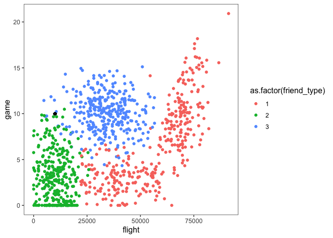
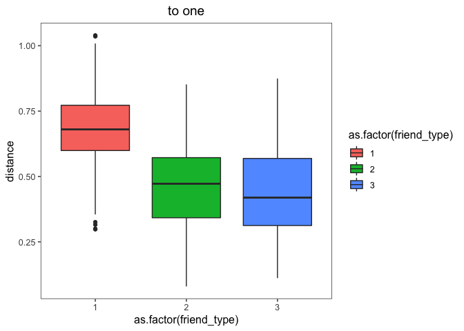
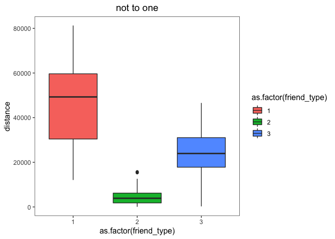

## read data


```r
library(tidyverse)
```

```
#> ── Attaching packages ─────────────────────────────── tidyverse 1.2.1 ──
```

```
#> ✔ ggplot2 3.0.0.9000     ✔ purrr   0.2.5     
#> ✔ tibble  1.4.2          ✔ dplyr   0.7.5     
#> ✔ tidyr   0.8.1          ✔ stringr 1.3.1     
#> ✔ readr   1.1.1          ✔ forcats 0.3.0
```

```
#> ── Conflicts ────────────────────────────────── tidyverse_conflicts() ──
#> ✖ dplyr::filter() masks stats::filter()
#> ✖ dplyr::lag()    masks stats::lag()
```

```r
library(ggthemes)
setwd("/Users/qiaoyixian/r-wd/Whispering")

hellen <- read_tsv("./data/交友.txt",col_names = FALSE,
                   locale = locale(encoding = "UTF-8")) 
```

```
#> Parsed with column specification:
#> cols(
#>   X1 = col_integer(),
#>   X2 = col_double(),
#>   X3 = col_double(),
#>   X4 = col_integer()
#> )
```

```r
names(hellen) <- c("flight","game","ice_cream","friend_type")
head(hellen)
```

```
#> # A tibble: 6 x 4
#>   flight  game ice_cream friend_type
#>    <int> <dbl>     <dbl>       <int>
#> 1  40920  8.33     0.954           3
#> 2  14488  7.15     1.67            2
#> 3  26052  1.44     0.805           1
#> 4  75136 13.1      0.429           1
#> 5  38344  1.67     0.134           1
#> 6  72993 10.1      1.03            1
```

## exploring data 


```r
ggplot(data = hellen)+
  geom_jitter(aes(x= flight, y= game, color= as.factor(friend_type)))+
  theme_few()+
  geom_point(aes(x=10000, y=10))
```




You can also embed plots, for example:


```r
to_one <- function(x) {
  stopifnot(is.vector(x))
  (x - min(x, na.rm = T))/(max(x, na.rm = T) - min(x, na.rm = T))
}
classify_friend_type <- function(data, accuracy, f, g, i) {
  flight_max <- max(data$flight)
  game_max <- max(data$game)
  ice_cream_max <- max(data$ice_cream)
  
  flight_min <- min(data$flight)
  game_min <- min(data$game)
  ice_cream_min <- min(data$ice_cream)
  
  flight_range <- flight_max - flight_min
  game_range <- game_max - game_min
  ice_cream_range <- ice_cream_max - ice_cream_min
  
  data_to_one <- data %>%
    mutate(
      flight_to_one = to_one(flight),
      game_to_one = to_one(game),
      ice_cream_to_one = to_one(ice_cream)
    )
  result <- data_to_one %>%
    mutate(distance = sqrt(((f - flight_min) / flight_range - flight_to_one)^2
                           + ((g - game_min) / game_range - game_to_one)^2 
                           + ((i - ice_cream_min) / ice_cream_range - ice_cream_to_one)^2
    )) %>%
    arrange(distance) %>%
    slice(1:(nrow(.) * accuracy)) %>%
    select(distance, friend_type) %>%
    group_by(friend_type) %>%
    summarise(n_count = n()) %>%
    arrange(desc(n_count)) %>%
    slice(1)
  if (result$friend_type == 1) {
    print('not at all')
  } else{
    if (result$friend_type == 2) {
      print('in small doses')
    } else {
      print('in large doses')
    }
  }
}

# classify_friend_type
classify_friend_type(data = hellen, accuracy = 0.03, f=10000, g=10, i= 0.5) 
```

```
#> [1] "in small doses"
```

```r
# plot boxplot
hellen_to_one <- hellen %>% 
  mutate(flight_to_one = to_one(flight),
         game_to_one = to_one(game),
         ice_cream_to_one = to_one(ice_cream))

flight_max <- max(hellen$flight)
game_max <- max(hellen$game)
ice_cream_max <- max(hellen$ice_cream)

flight_min <- min(hellen$flight)
game_min <- min(hellen$game)
ice_cream_min <- min(hellen$ice_cream)

flight_range <- flight_max - flight_min
game_range <- game_max - game_min
ice_cream_range <- ice_cream_max - ice_cream_min
    
hellen_to_one %>%
      mutate(distance = sqrt(((10000 - flight_min) / flight_range - flight_to_one)^2
                             + ((10 - game_min) / game_range - game_to_one)^2 
                             + ((0.5 - ice_cream_min) / ice_cream_range - ice_cream_to_one)^2
      )) %>% 
  ggplot(aes(x = as.factor(friend_type), y = distance, fill = as.factor(friend_type)))+
  geom_boxplot()+
  theme_few() + 
  ggtitle('to one') +
  theme(plot.title = element_text(hjust = 0.5))
```



```r
hellen %>% 
  mutate(distance = sqrt((10000- flight)^2+ (10 - game)^2 + (0.5 - ice_cream)^2)) %>% 
  ggplot(aes(x = as.factor(friend_type), y = distance, fill = as.factor(friend_type)))+
  geom_boxplot()+
  theme_few() +
  ggtitle('not to one')+
  theme(plot.title = element_text(hjust = 0.5))
```




